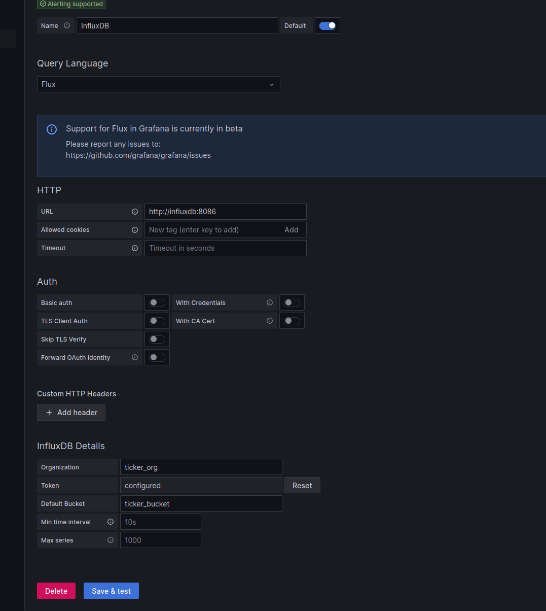

# SS-DM_Project
Course project for scalable systems and data management
run through 
``docker-compose up --build``
new terminal window to start flink job

``docker exec -it ss-dm_project-flink-jobmanager-1 sh -c "cd .. && ./bin/flink run -py /opt/flink/jobs/flink_processor.py"``

## Configuration 
Explanation of 

Flink, Grafanan influxdb

## With grafana and influxdb

In order to use influxdb we must configure it so that it can easily communicate with grafana. This can be done by going to 
http://localhost:8086/ and logging in using (username admin password admin 123). Navigate under the upload tab to "API tokens" and generate a new token. Name the new token Grafana and set the token in the .env file under INFLUX_DB_TOKEN.
This needs to be done before running the flink script and visualizing in grafana. 

After that, Run following command
``docker-compose up --build kafka_to_influx``
Just to make sure the script start succesfully as it is built from a different dockerfile than rest of containers

Data will now be put into influxdb bucket and saved for one hour
login to both influx and grafana with user admin and password admin123 
grafana dashboard avaible at http://localhost:3000/ 

## Grafana

In order to configure Grafana 
Log in to grafana on http://localhost:3000/ 

Navigate to Data Sources and press "Add a new data source".

The data source config in grafana should look similar to the following picture. 

Make sure that the option for query language is selected as Flux
Make sure to first optain an API key from Influx_DB and add it under TOKEN
Also add: 
host http://influxdb:8086/
and the rest like organistaion: ticker_org
and bucket: ticker_bucket

Save the data source.

The data source need to be added manually use the same token as the kafka to influx script uses.

After that the dahsboard needs to be uploaded manually, after the dahsboard has been set in .env file!

After that will need to update every view manully by selecting the datasource and executing the query!!

and the token then click save and test.

Then choose the dashboard that is already up in grafana and follow the data

Then the Dashboard can be uploaded into grafana. If it gives a "uid" error the uid values in the json needs to be updated

This can be done by obtaining the uid from the created datasource and updating the local json file. 
In order to obtain uid on needs to
1. create a "Service account in grafana"
2. Create a "Service account token"
3. Enter the grafana pod ``docker exec -it ss-dm_project-grafana-1 /bin/bash``
4.  copy the uid ``curl -H "Authorization: Bearer <service-account-token-here>" http://localhost:3000/api/datasources``
5. replace all instances of this uid in the json file in the financial-dashboard.

## Sort files 

sort_file.py will sort the input files by time for testing purposes.

The .env file contains a watch_list select there which symbols you want to be notified by mail for sell and buy decisions. Because the account can send limited amount of mails.

## Guide for TA;s to run a quick demo
0. Sort the file so that the csv ordering of stock data is correct. ``python3 sort_files.py``
1. bring up ``docker-compose up --build``
2. Configure influxdb
3. Bring up ``docker-compose up --build kafka_to_influx``
4. Configure Grafana
5. add your endpoint for .env for gmail by and sell announcements
6. Start the actual flink script which starts streaming and processing the data. 
``docker exec -it ss-dm_project-flink-jobmanager-1 sh -c "cd .. && ./bin/flink run -py /opt/flink/jobs/flink_processor.py"``

